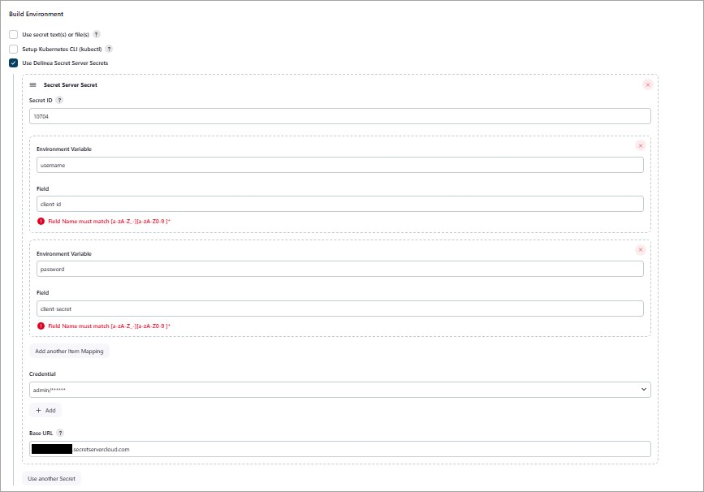

# Delinea Secret Server_Platform Jenkins Plugin

[](https://github.com/jenkinsci/thycotic-secret-server-plugin/actions/workflows/package.yml)


The **Delinea Secret Server_Platform Jenkins Plugin** enables Jenkins to securely access and reference secrets stored in **Delinea Secret Server** or **Delinea Platform** during builds.

For detailed information, refer to the [Delinea documentation](https://docs.delinea.com/online-help/integrations/jenkins/jenkins-build-secret-server.htm)

## Overview
This integration provides two main approaches for fetching secrets into Jenkins:

### **1. Fetching Secrets During Jenkins Builds**
You can retrieve secrets from Secret Server or Platform and inject them into your Jenkins build environment using either:

#### **A. Freestyle Project**
- Configure your build environment to include:
  - **Secret ID** (the identifier of the secret to fetch)
  - **Secret Server / Platform URL**
- Secrets become available as environment variables during the build.
- Ideal for integrating secrets into various stages of a freestyle Jenkins build.



#### **B. Pipeline Script**
Use the `withSecretServer` step in your Jenkins pipeline to fetch and map secret fields to environment variables.

**Example Pipeline:**
```groovy
pipeline {
    agent any
    stages {
        stage('Print Secret Fields') {
            steps {
                withSecretServer(secrets: [
                    [
                        id: 'SecretID',
                        credentialId: 'CredentialID',
                        baseUrl: 'Secret Server or Platform URL',
                        mappings: [
                            [field: 'username', environmentVariable: 'username'],
                            [field: 'password', environmentVariable: 'password']
                        ]
                    ]
                ]) {
                    bat '''
                        echo Username field: %TSS_username%
                        echo Password field: %TSS_password%
                    '''
                }
            }
        }
    }
}
```

#### **Delinea Proxy Configuration for Builds**
If your uses a proxy, configure global Delinea proxy settings. It is applicable for Freestyle Project and Pipeline.

**Steps:**
1. Navigate to:  
   `Dashboard > Manage Jenkins > System > Delinea Secret Server/Platform`
2. Configure:
   - **Proxy Host:** Hostname or IP of proxy server
   - **Proxy Port:** Port number
   - **Username (optional):** Proxy authentication username
   - **Password (optional):** Proxy authentication password
   - **No Proxy Hosts:** Comma-separated list of hosts to bypass proxy  
     *(e.g., test.secretserver.com,my-internal-server.com)*


### **2. Directly accessing and referencing Secret Server or Platform secrets**
You can directly retrieve secrets into a configuration called **credential resolver** and store the fetched credentials either in the Jenkins global credentials store or in a specific folder, limiting access to the folder to only certain users.

In addition to retrieving the standard **username** and **password** fields into the credential resolver, you can also fetch and store custom secret fields, for example, **client id** and **client secret**.


#### **Delinea Proxy Configuration for Credential Resolver**
If your uses a proxy, configure Delinea proxy settings.

**Steps:**
1. Configure:
   - **Proxy Host:** Hostname or IP of proxy server
   - **Proxy Port:** Port number
   - **Username (optional):** Proxy authentication username
   - **Password (optional):** Proxy authentication password
   - **No Proxy Hosts:** Comma-separated list of hosts to bypass proxy  
     *(e.g., test.secretserver.com,my-internal-server.com)*


This method is particularly useful if you want to be able to reference the stored secret values wherever you’re required to provide a username and password in Jenkins.
